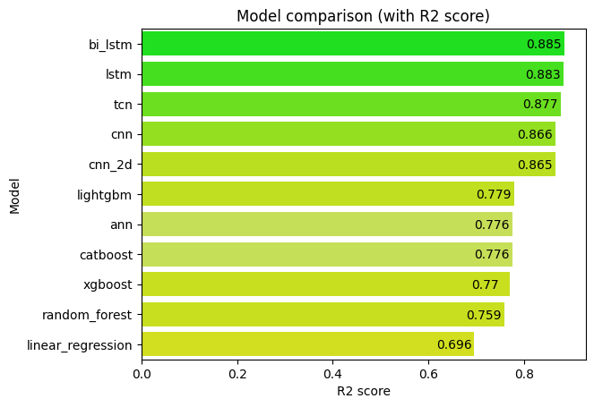

# RUL prediction for NASA CMAPSS dataset 🚀

### Model comparison


### Steps to use my repository 
- Clone my repository 

```bash
git clone https://github.com/Mainakcris7/RUL_CMAPSS.git
```

- Install all the dependencies

```bash
pip install -r requirements.txt
```

Run the files, and change the dataset as per requirement. I have used the FD001 dataset.
